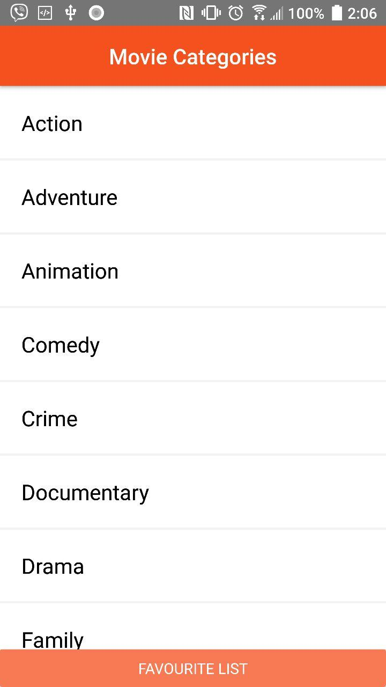
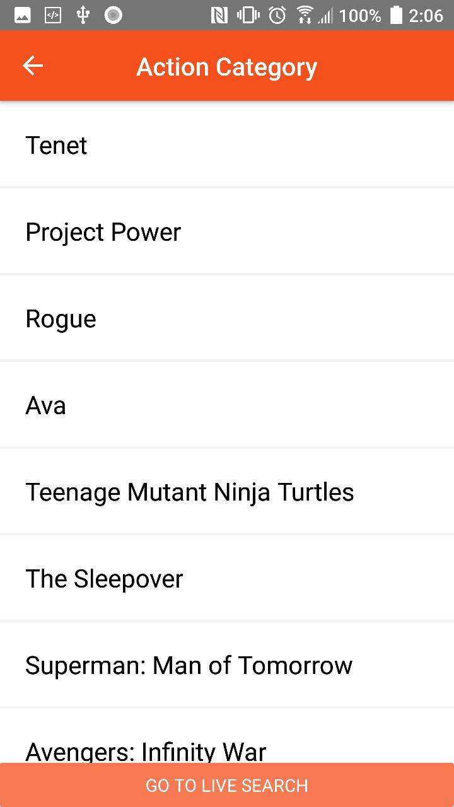
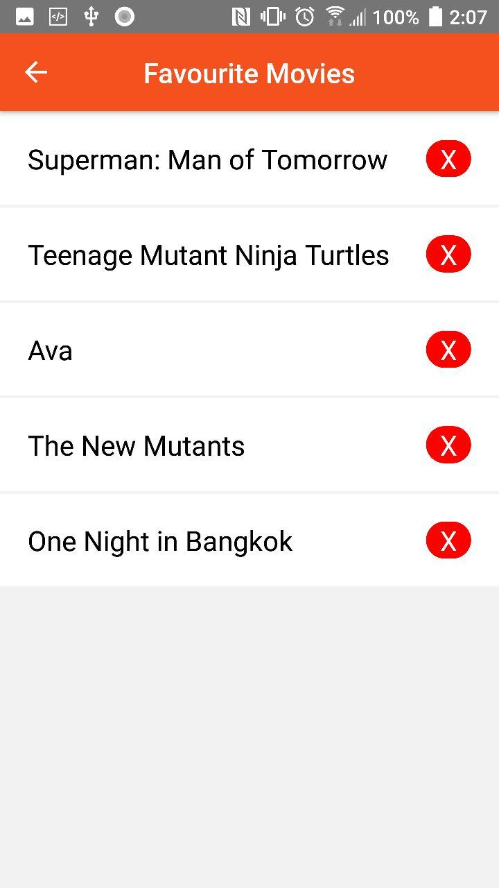
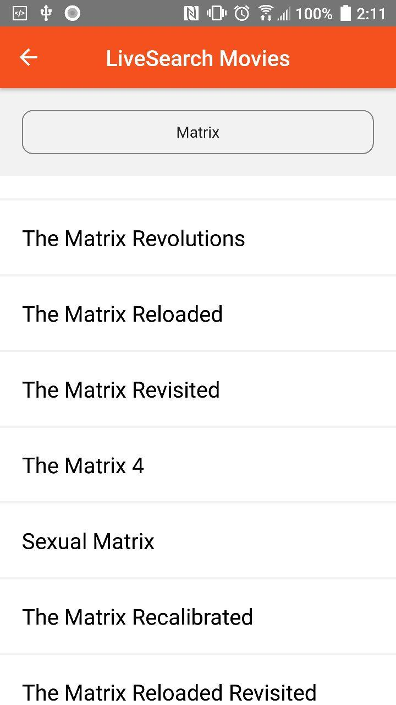

`Here is the app about movies`

 ### Technologies I have used
React-native, redux, redux-thunk, axios, react-navigation and jest

First install node_modules by

### `yarn install`

Then run the app by following command
### `react-native run-android`

Then run the test by following command
### `yarn test`

Please see the `screenshot` to see the view:

1. When you will open the app. you will see the following Home screen with all categories `genere`

2. If you click any of the row from the list you will be navigate to the next screen. you will see here single category (e.g: `Action`) if you go down you will see infinite scrolling.

3. If you click again the list item you will navigate to the `Details Screen`. In the bottom of the screen you will see red or green button. For favorite it color green and remove favourite it red. Please see the difference. It will always show one button.
   

5. If you go back to home screen and click the bottom button you will navigate to the favourite screen. Initally you will see such empty and back to home navigate button.

6. If you have favourite selection available you will such screen

7. If you go back to the home screen and navigate to the next screen by clicking list item. you will see another `bottom button` for `live search`. Initally it is empty but if you search movie you will see list of movie showing. If you go down you will see infinite scrolling. if you click list item form live search it will take you details screen.
   
